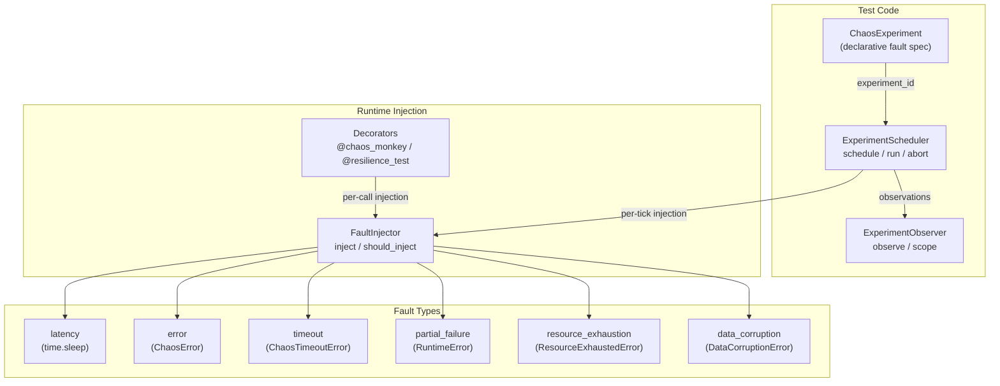

# aumai-chaos

Fault injection framework for testing agent resilience.

[](https://github.com/aumai/aumai-chaos/actions)
[](https://pypi.org/project/aumai-chaos/)
[](LICENSE)
[](https://python.org)

---

## What is this?

When an AI agent calls an external tool, what happens if that tool takes 10 seconds
instead of 100 milliseconds? What if it returns a 503 error every third call? What if
the vector database returns corrupted data under load?

Most developers test their agents under ideal conditions: fast responses, no errors,
all tools behaving as documented. This produces agents that work perfectly in demos and
fail unpredictably in production.

**aumai-chaos** is a fault injection framework that deliberately breaks things. You
specify what should go wrong (slow responses, errors, timeouts, resource exhaustion,
data corruption) and how often it should happen. The framework injects those faults
into your running agent code, letting you observe and fix failure modes before your
users encounter them.

Think of it as **controlled sabotage**. The goal is not to break production — it is to
break things in your test environment so thoroughly that production stays stable.

---

## Why does this matter?

### Chaos engineering for agents is different from chaos engineering for services

Traditional chaos engineering (Netflix's Chaos Monkey, Gremlin) targets infrastructure:
it kills VMs, saturates network links, or fills disks. This works for microservices
because the failure modes are well-understood.

AI agents have different failure modes:

- **LLM tool calls** may silently return degraded output when the upstream API is slow
  instead of raising an exception.
- **Retry logic** in agent frameworks may mask intermittent errors, creating ghost
  latency that inflates P99 response times without triggering alerts.
- **Multi-step reasoning chains** can propagate corrupted intermediate results through
  five tool calls before producing a wrong final answer.
- **Resource constraints** (context window limits, rate limits) can cause agents to
  silently truncate or omit information.

aumai-chaos targets the Python function boundary — the layer between your agent
orchestrator and its tools. You control exactly which code paths receive faults,
with what probability, and for how long.

---

## Architecture



---

## Features

| Feature | Description |
|---|---|
| **6 fault types** | Latency, error, timeout, partial failure, resource exhaustion, data corruption |
| **Probabilistic injection** | Each fault fires with a configurable probability (0.0–1.0) |
| **Declarative experiments** | Define multi-fault experiments in YAML or JSON |
| **ExperimentScheduler** | Run timed experiments; abort mid-run with thread safety |
| **ExperimentObserver** | Thread-safe observation collection with scope context manager |
| **`@chaos_monkey` decorator** | One-line fault injection on any function |
| **`@resilience_test` decorator** | Apply a list of faults before each function call |
| **Typed exceptions** | Each fault raises a distinct, catchable exception subclass |
| **CLI** | `run`, `inject`, `report` commands |

---

## Quick Start

### Install

```bash
pip install aumai-chaos
```

### Inject a fault in one line

```python
from aumai_chaos import chaos_monkey, FaultType

@chaos_monkey(fault_type=FaultType.latency, probability=0.3, duration_ms=500)
def call_tool(payload: dict) -> dict:
    """This function has a 30% chance of sleeping 500ms before executing."""
    return {"result": "ok"}

# Call it — sometimes it will be slow
result = call_tool({"query": "hello"})
```

### Run a one-off fault injection from the CLI

```bash
aumai-chaos inject --fault latency --duration 2000 --target my-tool
# Injecting 'latency' fault into component 'my-tool'...
# Fault injection complete (no exception raised — e.g., latency).

aumai-chaos inject --fault error --error-code 503 --message "Service unavailable"
# Injecting 'error' fault into component '*'...
# Fault raised: ChaosError: [503] Service unavailable
```

### Run a structured experiment

```bash
# Create an experiment definition
cat > experiment.yaml << 'EOF'
experiment_id: "latency-test-001"
name: "Baseline latency experiment"
description: "Inject 200ms latency into all tool calls 50% of the time"
duration_seconds: 5
target_components:
  - tool_executor
faults:
  - fault_type: latency
    probability: 0.5
    duration_ms: 200
  - fault_type: error
    probability: 0.1
    error_code: 503
    error_message: "Upstream timeout"
EOF

aumai-chaos run --experiment experiment.yaml
```

---

## CLI Reference

### `aumai-chaos run`

Load a YAML or JSON experiment definition, schedule it, run it for the specified
duration, and print the results.

```
Usage: aumai-chaos run [OPTIONS]

  Run a chaos experiment defined in a YAML/JSON file.

Required:
  --experiment PATH    Path to experiment definition (YAML or JSON).

Optional:
  --json-output        Emit ExperimentResult as JSON.
```

**Examples:**

```bash
# Human-readable output
aumai-chaos run --experiment ./my-experiment.yaml

# JSON output (redirect for persistence)
aumai-chaos run --experiment ./my-experiment.yaml --json-output > result.json

# Inspect the result
cat result.json | python -m json.tool
```

**Experiment YAML schema:**

```yaml
experiment_id: "my-exp-001"       # string, required
name: "My Experiment"              # string, required
description: "Optional notes"     # string, optional
duration_seconds: 30              # int > 0, required
target_components:                 # list of component labels
  - llm_tool_call
  - vector_search
faults:
  - fault_type: latency            # one of: latency, error, timeout,
    probability: 0.5               #         partial_failure, resource_exhaustion,
    duration_ms: 300               #         data_corruption
  - fault_type: error
    probability: 0.1
    error_code: 500
    error_message: "Internal error"
```

---

### `aumai-chaos inject`

Perform an immediate, one-off fault injection and report whether an exception was
raised.

```
Usage: aumai-chaos inject [OPTIONS]

  Perform a one-off fault injection immediately.

Required:
  --fault CHOICE    Fault type: latency | error | timeout | partial_failure
                    | resource_exhaustion | data_corruption

Optional:
  --duration INT      Duration in ms for latency faults.   [default: 500]
  --error-code INT    HTTP-style error code for error faults. [default: 500]
  --message TEXT      Error message for error/partial_failure faults.
  --target TEXT       Component label for observability.   [default: *]
```

**Examples:**

```bash
# Inject 2-second latency
aumai-chaos inject --fault latency --duration 2000

# Inject a 503 error
aumai-chaos inject --fault error --error-code 503 --message "Rate limited"

# Inject a timeout
aumai-chaos inject --fault timeout

# Inject resource exhaustion into a specific component
aumai-chaos inject --fault resource_exhaustion --target vector-db
```

---

### `aumai-chaos report`

Note: the scheduler is in-process only. Results persist within a single session.
Use `aumai-chaos run --json-output > result.json` to persist experiment results
for later analysis.

```
Usage: aumai-chaos report [OPTIONS]

  Display the results of a completed chaos experiment.

Required:
  --experiment-id ID    ID of the experiment to report on.

Optional:
  --json-output         Emit raw JSON.
```

---

## Python API

### Direct fault injection

```python
from aumai_chaos import FaultInjector, FaultConfig, FaultType

injector = FaultInjector()

# Inject latency unconditionally
injector.inject_latency(duration_ms=300)

# Inject an error
try:
    injector.inject_error(error_code=503, message="Service unavailable")
except Exception as exc:
    print(f"Caught: {exc}")

# Probabilistic injection via FaultConfig
config = FaultConfig(
    fault_type=FaultType.latency,
    probability=0.25,
    duration_ms=200,
)
injector.inject(config)  # fires 25% of the time; no-op the other 75%
```

### `@chaos_monkey` decorator

```python
from aumai_chaos import chaos_monkey, FaultType

@chaos_monkey(fault_type=FaultType.error, probability=0.15, error_code=429)
def call_llm_api(prompt: str) -> str:
    """15% chance of a 429 rate-limit error on every call."""
    return "LLM response"

# Your agent code calls this normally
try:
    response = call_llm_api("What is the capital of France?")
except Exception as exc:
    print(f"Handling error: {exc}")
    response = "fallback response"
```

### `@resilience_test` decorator

Apply multiple fault types in sequence before each function call.

```python
from aumai_chaos import resilience_test, FaultConfig, FaultType

@resilience_test(faults=[
    FaultConfig(fault_type=FaultType.latency, probability=0.5, duration_ms=100),
    FaultConfig(fault_type=FaultType.error, probability=0.1, error_code=503),
    FaultConfig(fault_type=FaultType.timeout, probability=0.05),
])
def search_knowledge_base(query: str) -> list[str]:
    return ["result1", "result2"]
```

### Structured experiments with ExperimentScheduler

```python
from aumai_chaos import (
    ChaosExperiment, ExperimentScheduler, FaultConfig, FaultType,
)

experiment = ChaosExperiment(
    experiment_id="exp-001",
    name="Tool latency stress test",
    description="10 seconds of 40% latency injection",
    duration_seconds=10,
    target_components=["tool_executor"],
    faults=[
        FaultConfig(
            fault_type=FaultType.latency,
            probability=0.4,
            duration_ms=250,
            affected_components=["tool_executor"],
        ),
        FaultConfig(
            fault_type=FaultType.error,
            probability=0.05,
            error_code=500,
            error_message="Simulated internal error",
        ),
    ],
)

scheduler = ExperimentScheduler()
experiment_id = scheduler.schedule(experiment)
result = scheduler.run(experiment_id)  # blocks for duration_seconds

print(f"Status: {result.status.value}")
print(f"Total faults fired: {result.summary['total_faults_fired']}")
print(f"Observations recorded: {len(result.observations)}")
```

### ExperimentObserver for custom observation

```python
from aumai_chaos import ExperimentObserver

observer = ExperimentObserver()

# Record observations manually
observer.observe("database", "query_start", {"query": "SELECT ..."})
observer.observe("database", "query_end", {"rows": 42})

# Use the scope context manager for automatic start/end recording
with observer.scope("vector_search", "embed"):
    embeddings = embed_text("hello world")  # start and end events recorded automatically

# Retrieve all observations
for point in observer.get_observations():
    print(f"{point.timestamp.isoformat()} [{point.component}] {point.event}")
```

### Abort a running experiment

```python
import threading
from aumai_chaos import ExperimentScheduler, ChaosExperiment, FaultConfig, FaultType

experiment = ChaosExperiment(
    experiment_id="long-exp",
    name="Long-running test",
    duration_seconds=300,
    faults=[FaultConfig(fault_type=FaultType.latency, probability=0.2, duration_ms=100)],
)

scheduler = ExperimentScheduler()
experiment_id = scheduler.schedule(experiment)

# Run in a background thread
thread = threading.Thread(target=scheduler.run, args=(experiment_id,))
thread.start()

# Abort after 10 seconds
import time
time.sleep(10)
scheduler.abort(experiment_id)
thread.join()

result = scheduler.get_result(experiment_id)
print(result.status.value)  # "aborted"
```

---

## Configuration Options

### `FaultConfig` field reference

| Field | Type | Default | Required | Description |
|---|---|---|---|---|
| `fault_type` | `FaultType` | — | yes | Which fault to inject |
| `probability` | `float` [0,1] | `1.0` | no | Fraction of calls that fire |
| `duration_ms` | `int >= 0 \| None` | `None` | for `latency` | Sleep duration in ms |
| `error_code` | `int \| None` | `None` | for `error` | HTTP-style code stored in `ChaosError` |
| `error_message` | `str \| None` | `None` | no | Message for error/partial_failure faults |
| `affected_components` | `list[str]` | `[]` | no | Component labels for observation tagging |

### `ChaosExperiment` field reference

| Field | Type | Default | Description |
|---|---|---|---|
| `experiment_id` | `str` | — | Unique identifier; preserved or auto-assigned by `schedule` |
| `name` | `str` | — | Human-readable name |
| `description` | `str` | `""` | Optional notes |
| `faults` | `list[FaultConfig]` | `[]` | Faults to inject on each tick |
| `duration_seconds` | `int > 0` | `60` | How long the experiment runs |
| `target_components` | `list[str]` | `[]` | Default component labels (used when `fault.affected_components` is empty) |

---

## Fault Type Reference

| FaultType | Exception raised | `duration_ms` needed | `error_code` needed |
|---|---|---|---|
| `latency` | (none — blocks then returns) | yes | no |
| `error` | `ChaosError(error_code, message)` | no | yes |
| `timeout` | `ChaosTimeoutError` | no | no |
| `partial_failure` | `RuntimeError("[partial_failure] …")` | no | no |
| `resource_exhaustion` | `ResourceExhaustedError` | no | no |
| `data_corruption` | `DataCorruptionError` | no | no |

All exception classes are importable from `aumai_chaos`:

```python
from aumai_chaos import (
    ChaosError, ChaosTimeoutError, DataCorruptionError,
    ResourceExhaustedError,
)
```

---

## How It Works — Technical Deep Dive

### Probabilistic injection

`FaultInjector.should_inject(probability)` calls `random.random()` and compares the
result to `probability`. This uses Python's default Mersenne Twister PRNG, which is
not cryptographically secure but is sufficient for chaos testing. Seed with
`random.seed(42)` in tests for reproducible injection sequences.

### Experiment execution loop

`ExperimentScheduler.run` executes a tight loop at 1-second tick intervals:

1. Check the abort flag (set by `abort()`).
2. For each `FaultConfig` in `experiment.faults`:
   - For each target component, call `FaultInjector.inject(fault)`.
   - If injection fires and raises, record an error observation.
   - If injection fires and does not raise (latency), record a success observation.
3. Sleep 1 second.
4. Repeat until the deadline or abort.

Each `run()` call creates a fresh `ExperimentObserver`, so concurrent experiments
on the same scheduler instance do not share observation state.

### Thread safety in ExperimentObserver

`ExperimentObserver` guards all mutations with a `threading.Lock`. This is a stronger
guarantee than relying on CPython's GIL, and correctly handles scenarios under
free-threaded Python (PEP 703).

### Decorator implementation

`@chaos_monkey` and `@resilience_test` create a `FaultConfig` and a `FaultInjector`
at decoration time (not at call time), so the cost of building those objects is paid
once. On each function call, `injector.inject(config)` is called before the wrapped
function body executes.

---

## Integration with Other AumAI Projects

- **aumai-pii-redactor** — Wrap your PII redactor calls with `@chaos_monkey` to test
  that your agent gracefully handles redaction failures or slow PII detection.
- **aumai-modelseal** — Inject signature verification errors to test that your model
  loading pipeline rejects tampered artifacts and falls back correctly.
- **aumai-specs** — Combine declarative experiment definitions with aumai-specs
  validation to ensure that experiment JSON/YAML conforms to schema before running.

---

## Contributing

Contributions are welcome. Please read `CONTRIBUTING.md` for the full workflow.

- New fault types require a dedicated exception class and a `FaultInjector` method.
- All new code requires type annotations (mypy strict).
- Run `make lint test` before submitting a PR.

---

## License

Apache License 2.0. See [LICENSE](LICENSE) for full text.

Copyright 2024 AumAI Contributors.
